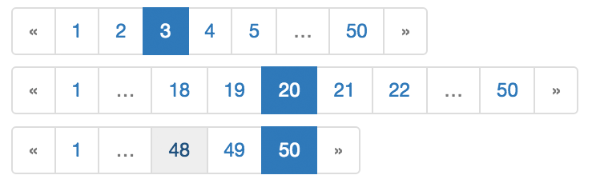

=====================
django-rangepaginator
=====================

Simple Django app to create sane paginators

Status
======
.. image:: https://travis-ci.org/mvantellingen/django-rangepaginator.svg?branch=master
    :target: https://travis-ci.org/mvantellingen/django-rangepaginator

.. image:: http://codecov.io/github/mvantellingen/django-rangepaginator/coverage.svg?branch=master 
    :target: http://codecov.io/github/mvantellingen/django-rangepaginator?branch=master
    
.. image:: https://img.shields.io/pypi/v/django-rangepaginator.svg
    :target: https://pypi.python.org/pypi/django-rangepaginator/

Installation
============

.. code-block:: shell

   pip install django_rangepaginator
   
Usage
=====

.. code-block:: django

    
    
